# Sky companion

### Problem Statement:

People often require assistance when traveling. This frequently happens on flights with multiple stopovers. People need to check in, security check, navigate the airport, need in-flight support, change terminals, and even check in their luggage sometimes again on the same route. Through our system, users will be able to find companions who will help them on their journey. The companion will already be traveling on the same route.

### Our Solution

Sky Companion is an affordable way to find companions on the same flight. Free companionship is provided by Volunteers. End to end Availability on a wide range of routes as anyone can be a companion, independent of airlines. It provides an option to Customize the routes. Profile review and rating along with chat feature.

### Test Case Coverage


## Build/deployment instructions

### React instructions

This project is set up using pnpm and vite + react using typescript.

- https://pnpm.io/installation
- https://vitejs.dev/

Prerequisite

- Setup Project environment

  - download and setup pnpm
  - use pnpm to install dependencies for checked out project

- Install extensions

  - after checking out the project it will ask to install some recommended extensions install them
  - if not asked, open the extensions.json file in the .vscode folder and install all mentioned extensions

- Setup prettier in VS code

  - install prettier and prettier-eslint extension
  - open settings/preferences in vs code and search format on save
  - in any file do ctrl(cmd)+shift+p and search format document and select prettier as the default formatter

- To run the project
  - first run `pnpm install` from the project directory
  - then run `pnpm run dev` to start the project

Environment variables

- Create a .env file in react project root and have the following environment variables and change the value of variables as per your system

```
VITE_PUBLIC_API_BASE_URL=${api-url} #backend API URL used by the frontend
```

### Java instructions

- IntelliJ IDEA setup
  - In settings find Actions on Save and enable all options except build code
- Install sonarlint plugin
  - https://plugins.jetbrains.com/plugin/7973-sonarlint
- To run the project
  - Make sure Mysql is running in the local system.
  - Make sure Maven is installed in the system and environment variables are set
  - To run the project find a `SkyCompanionApplication` class and run that as a Java application
  - Visit `localhost:8080` and check logs
- To run test cases
  - Move to the Java project root directory
  - run command `mvn test`, this will run test cases and give results in the terminal

## Dependencies

### Frameworks and Tools used

| Dependency Name                                    | Version | Description                                                                                                                                                                                                                                       |
| -------------------------------------------------- | ------- | ------------------------------------------------------------------------------------------------------------------------------------------------------------------------------------------------------------------------------------------------- |
| [VS Code](https://code.visualstudio.com/)          | 1.84    | A code editing platform that offers a wide range of features for software development, including code completion, debugging, and version control.                                                                                                 |
| [Intellij idea](https://www.jetbrains.com/idea/)   | 2023.1  | A powerful integrated development environment (IDE) for Java, Kotlin, and other languages, offering a wide range of features for software development, including code completion, debugging, and version control.                                 |
| [MySQL](https://www.mysql.com/products/workbench/) | 8.0     | A popular open-source relational database management system (RDBMS) used for storing, manipulating, and retrieving data in various formats.                                                                                                       |
| [Postman](https://www.postman.com/downloads/)      | 8.13.0  | A tool for testing, building, and troubleshooting APIs, offering a wide range of features such as API request builders, response analyzers, and collaboration tools.                                                                              |
| [Maven](https://maven.apache.org/download.cgi)     | 3.8.1   | An open-source build automation tool used for managing and building software projects, offering a wide range of features such as dependency management, project management, and build automation.                                                 |
| [Java 8](https://openjdk.org/projects/jdk8/)       | 8.0     | A version of the Java programming language and runtime environment, offering a wide range of features such as improved performance, security, and compatibility.                                                                                  |
| [Node JS](https://nodejs.org/en)                   | 14.17.0 | A JavaScript runtime built on Chrome's V8 JavaScript engine, used for developing scalable, high-performance applications, offering a wide range of features such as event-driven programming, non-blocking I/O, and a vast ecosystem of packages. |

### React Runtime Dependencies

The following is a list of necessary dependencies for building this React application using TypeScript and Vite.

| Name                      | Version  | Description                                                                                        |
| ------------------------- | -------- | -------------------------------------------------------------------------------------------------- |
| @tanstack/react-query     | ^4.35.3  | A library for handling data fetching and caching in React applications.                            |
| @types/react-star-ratings | ^2.3.3   | Type definitions for the React Star Ratings component.                                             |
| axios                     | ^1.5.0   | A promise-based HTTP client for JavaScript.                                                        |
| dayjs                     | ^1.11.10 | A lightweight JavaScript date library for parsing, validating, manipulating, and formatting dates. |
| react                     | ^18.2.0  | A JavaScript library for building user interfaces.                                                 |
| react-dom                 | ^18.2.0  | A library for rendering React components to the DOM.                                               |
| react-router-dom          | ^6.16.0  | A library for handling client-side routing in React applications.                                  |
| react-star-ratings        | ^2.3.0   | A React component for displaying star ratings.                                                     |
| react-toastify            | ^9.1.3   | A library for displaying toast notifications in React applications.                                |
| react-typed               | ^1.2.0   | A library for adding type definitions to React components.                                         |
| zustand                   | ^4.4.1   | A library for managing state in React applications.                                                |

### React Development Dependencies

| Name                             | Version  | Description                                                                        |
| -------------------------------- | -------- | ---------------------------------------------------------------------------------- |
| @types/node                      | ^20.6.2  | Type definitions for Node.js.                                                      |
| @types/react                     | ^18.2.15 | Type definitions for React.                                                        |
| @types/react-dom                 | ^18.2.7  | Type definitions for ReactDOM.                                                     |
| @typescript-eslint/eslint-plugin | ^6.0.0   | An ESLint plugin for TypeScript.                                                   |
| @typescript-eslint/parser        | ^6.0.0   | An ESLint parser for TypeScript.                                                   |
| @vitejs/plugin-react             | ^4.0.3   | A Vite plugin for React.                                                           |
| autoprefixer                     | ^10.4.15 | A PostCSS plugin for adding vendor prefixes to CSS rules.                          |
| eslint                           | ^8.45.0  | A tool for identifying and reporting patterns found in ECMAScript/JavaScript code. |
| eslint-config-prettier           | ^9.0.0   | An ESLint configuration for Prettier.                                              |
| eslint-formatter-gitlab          | ^5.1.0   | An ESLint formatted for GitLab.                                                    |
| eslint-plugin-react              | ^7.33.2  | An ESLint plugin for React.                                                        |
| eslint-plugin-react-hooks        | ^4.6.0   | An ESLint plugin for React hooks.                                                  |
| eslint-plugin-react-refresh      | ^0.4.3   | An ESLint plugin for React refresh.                                                |
| postcss                          | ^8.4.30  | A tool for transforming styles with JS plugins.                                    |
| prettier-plugin-organize-imports | ^3.2.3   | A Prettier plugin for organizing imports.                                          |
| tailwindcss                      | ^3.3.3   | A utility-first CSS framework for rapidly building custom designs.                 |
| typescript                       | ^5.0.2   | A superset of JavaScript that adds optional static typing and other features.      |
| vite                             | ^4.4.5   | A fast and efficient frontend build tool.                                          |

These dependencies are required for building and running the application. The development dependencies are used during development and testing.

### Spring Boot Dependencies

| Dependency Name                | Version | Short Description                  |
| ------------------------------ | ------- | ---------------------------------- |
| spring-boot-starter-data-jpa   | 2.7.16  | Spring Boot starter for JsPA       |
| spring-boot-starter-security   | 2.7.16  | Spring Boot starter for security   |
| spring-boot-starter-validation | 2.7.16  | Spring Boot starter for validation |
| spring-boot-starter-web        | 2.7.16  | Spring Boot starter for web        |
| spring-boot-devtools           | 2.7.16  | Spring Boot devtools for debugging |
| mysql-connector-j              | 8.0.28  | MySQL connector for Java           |
| spring-boot-starter-test       | 2.7.16  | Spring Boot starter for testing    |
| spring-security-test           | 5.7.1   | Spring Security test               |

### Mockito Dependencies

| Dependency Name       | Version | Short Description                 |
| --------------------- | ------- | --------------------------------- |
| mockito-core          | 3.12.4  | Mockito core for testing          |
| mockito-inline        | 3.12.4  | Mockito inline for testing        |
| mockito-junit-jupiter | 3.12.4  | Mockito JUnit Jupiter for testing |

### JSON Web Token (JWT) Dependencies

| Dependency Name | Version | Short Description                     |
| --------------- | ------- | ------------------------------------- |
| jjwt-api        | 0.11.1  | JSON Web Token API                    |
| jjwt-impl       | 0.11.1  | JSON Web Token implementation         |
| jjwt-jackson    | 0.11.1  | JSON Web Token Jackson implementation |

### Build Tools

| Dependency               | Version | Description                                                   |
| ------------------------ | ------- | ------------------------------------------------------------- |
| spring-boot-maven-plugin | 2.3.0   | A convenient way to package and run Spring Boot applications. |

## Usage Scenarios for Sky Companion

### Introduction

Sky Companion is a platform designed to connect individuals looking for travel companions. This outlines the user interaction flow, from website entry to the start of a travel journey, including steps for account creation, login, and password recovery.

The following User Flow Diagram explains how different scenarios interact with different features of the application

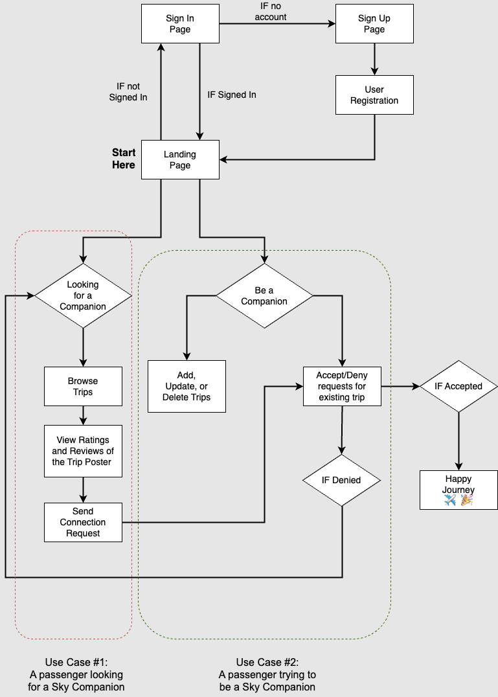

### Screens common for all users

#### Landing Page

- Upon visiting Sky Companion, users are presented with options to `Log In` or `Sign Up`.


#### Authentication

##### Log In

- Existing users enter their credentials to access their accounts.

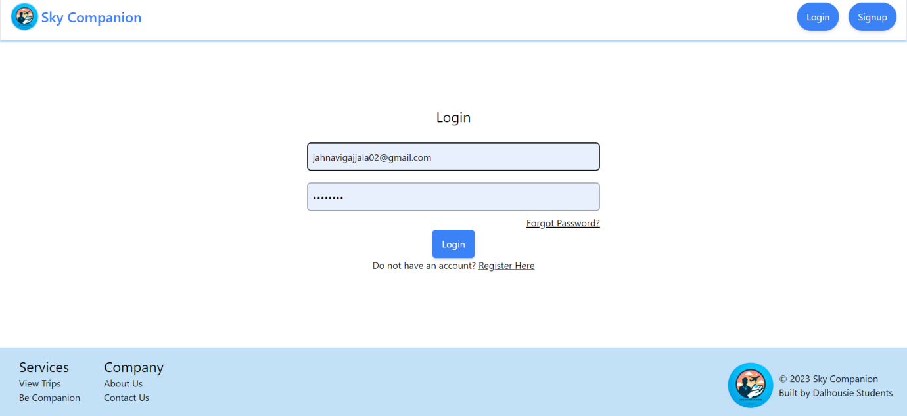

##### Sign Up

- New users navigate to the `Sign Up Page` and complete `User Registration` to create an account.

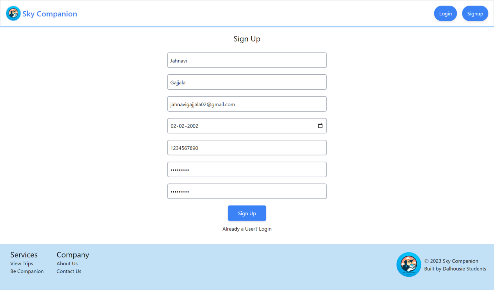

- Users must verify their email address to activate their account.

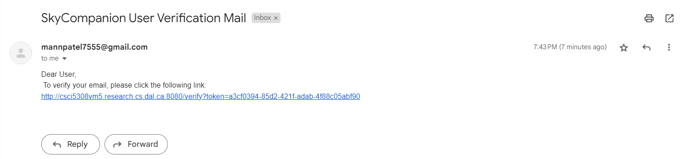

- Once the user clicks on the verification link, they are redirected to this page. Now, the user can log in.

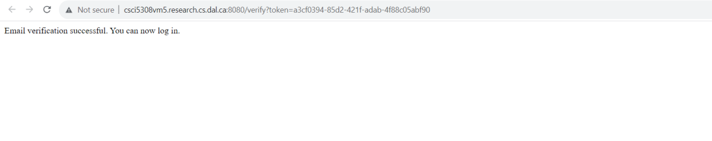

##### Forgot Password

- Users who have forgotten their password can use the 'Forgot Password' link to reset it via their registered email.

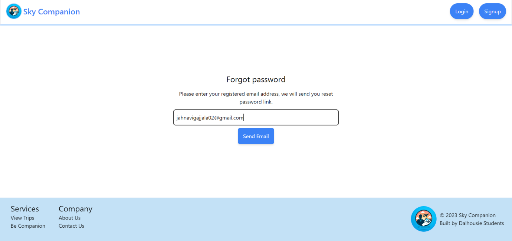

#### User Dashboard

- Once authenticated, the user is directed to the landing page. The dashboard offers two main pathways: 'Looking for a Companion' and 'Be a Companion.'

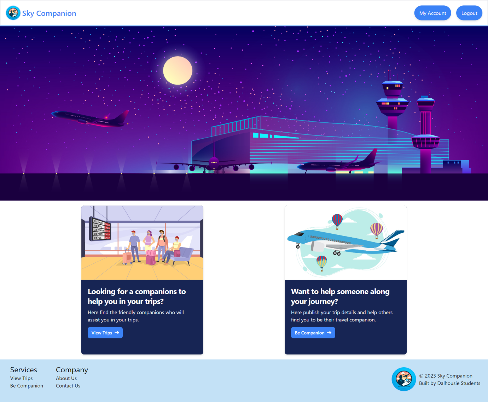

#### Modify Profile

- Users can update their personal details such as name, email, and phone number.
- Location details can be updated to enhance the search for companions based on similar locations.
- Language preferences can be set to match with users who speak the same languages.

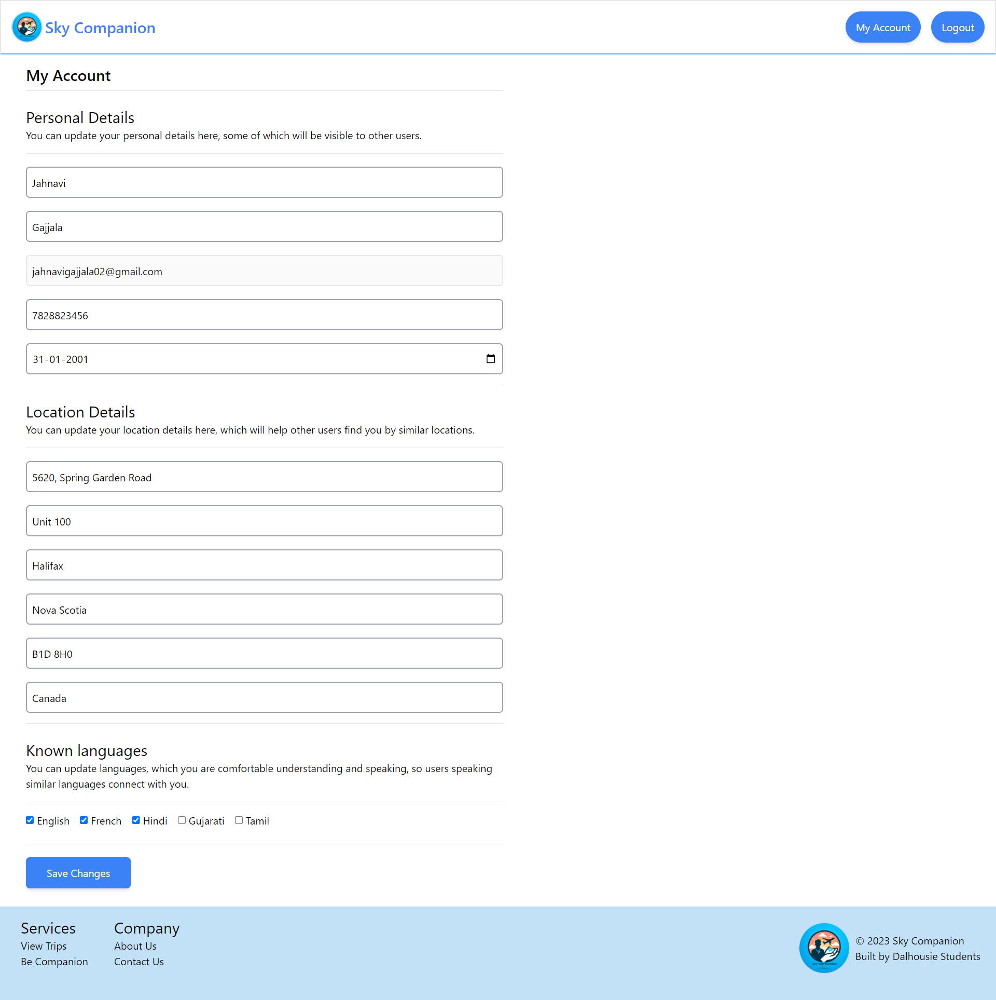

### Screens for users looking for a Companion

- Users select `View Trips` to browse available trips.

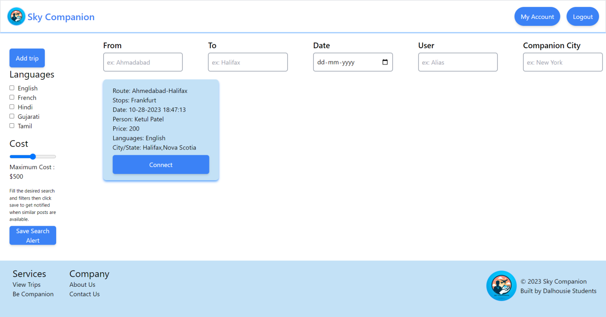

- Users can connect with trip posters by clicking on `Connect` and can view the person's ratings and reviews.


- To send a companionship request to the companion, click on “Send Email” button.

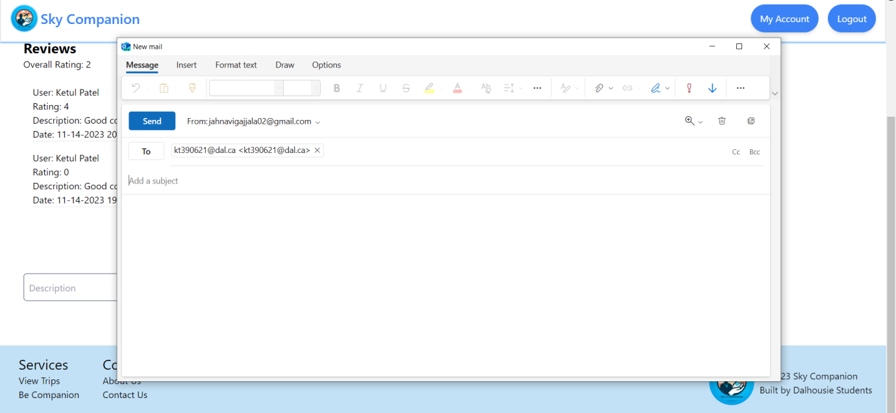

### Save Search Alert

- Users can set filters and preferences for their trip search.
- By clicking `Save Search Alert`, users can receive notifications when trips matching their criteria are posted.


### Screens for users looking to be a Companion

- Users wishing to offer companionship can `Add`, `Update`, or `Delete` trips in their profile.


- To add a trip, users click on `Be Companion`.
- When a trip is added, other users can send requests to join.
- Users can accept or deny join requests for their trips.

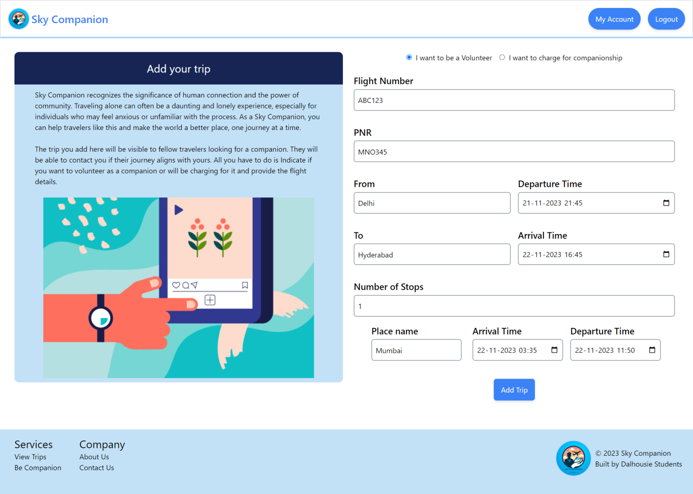

- The trip is added and can be viewd in “View trips”.

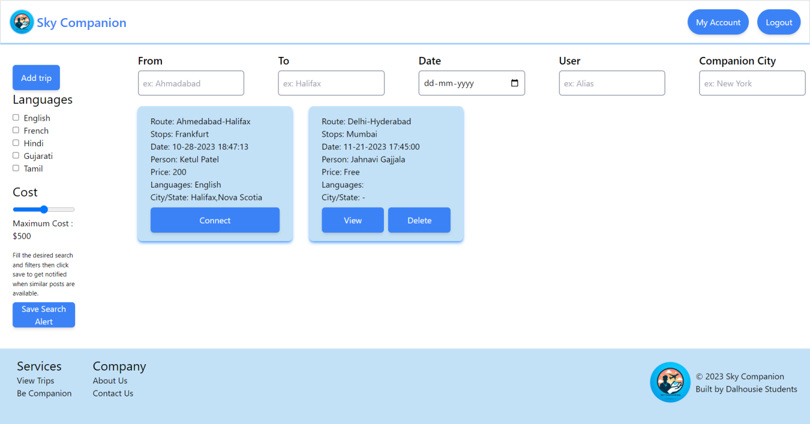

- To delete the trip, click on “Delete” button of the post. Only the person who added the trip can delete it.


- To edit the trip, click on “View” button of the post. Only the person who added the trip can edit it. The change can be made in the paid or volunteer service option.

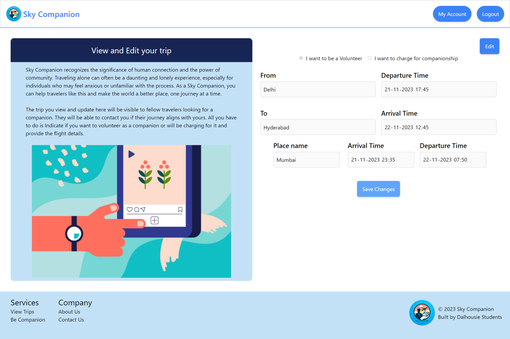

- If they want to change to paid service, select "I want to charge for companionship" and enter the price.

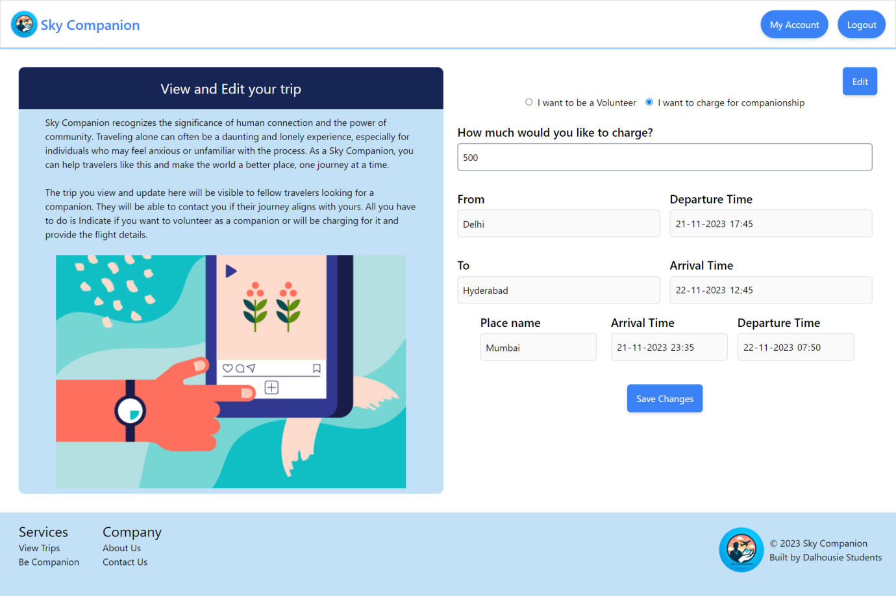

- Click on "Save Changes" to save.

### Matching Process

- When a join request is received, the user reviews the requester's profile.
- If the user accepts the request, both parties are notified.
- If denied, the requester is notified and can continue to search.

### Post-Journey

- Users are encouraged to rate and review their travel companions post-journey.

## Conclusion

This provides the steps a user will follow on the Sky Companion service, ensuring a clear path from sign-up to journey engagement.

## Credits

### Development team:

1. Divyank Mayankkumar Shah
2. Jahnavi Gajjala
3. Jahnavi Prasad Srirampurapu
4. Ketul Patel
5. Mann Patel

Professor - Tushar Sharma
